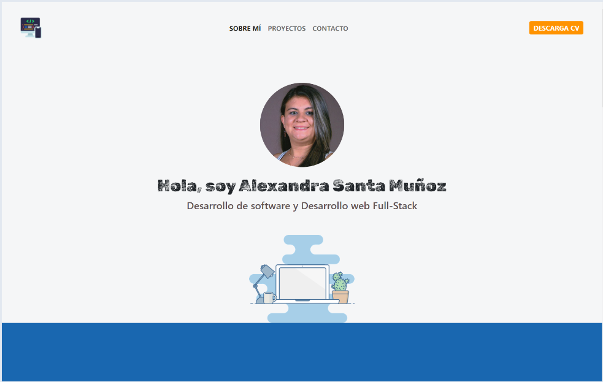

# Portafolio Adaptable (Responsive) con Bootstrap 5 - ALEXANDRA SANTA MUÑOZ

Este es mi portafolio profesional donde muestro mis proyectos de Desarrollo de Software y Desarrollo web.

## Autora

[@Alexandra-Santa-Muñoz](https://www.linkedin.com/in/asamu10/)

## Repositorio de Github

Este es el [link](https://github.com/alexa272/developer-portfolio) a el repositorio del proyecto en github

## Sitio web

Aqui puedes ver en vivo mi portafolio [link](https://portafolioprofesional-asm.netlify.app/?)

## Tecnologías

Esta página web fue creada con:

* HTML
* CSS
* JavaScript 
* Bootstrap 5

Además, se incluyeron **Google Fonts** para personalizar la fuente y **Bootstrap icons** para incorporar logos de redes sociales populares. 

## Curso en YouTube - Bootstrap 5

Para crear este proyecto de portafolio profesional segui paso a paso el curso creado por freeCodecamp en su canal de YouTube (https://www.youtube.com/freecodecampespanol). Se realizaron adaptaciones del código según mis gustos personales, claramente contando con el aval previamente de la tutora Estefania Cassingena Navone Utilizó como base el desarrollo realizado dentro del curso.
